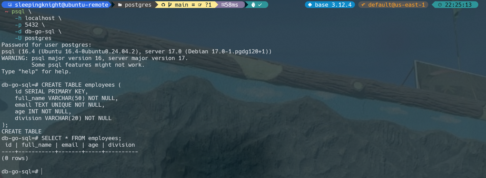
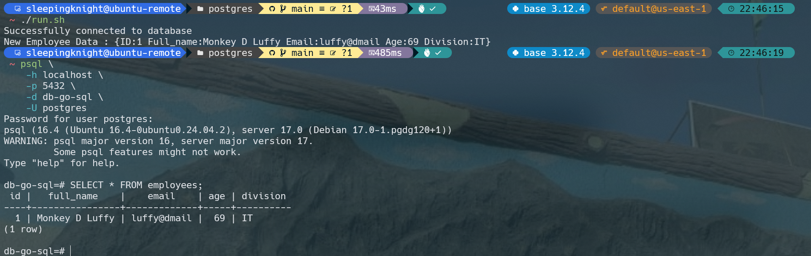
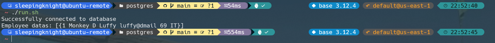
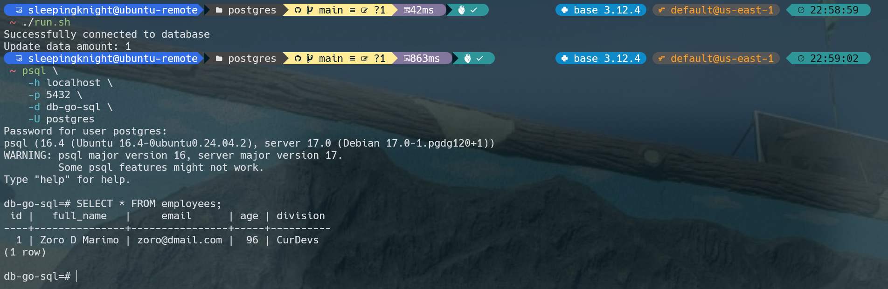
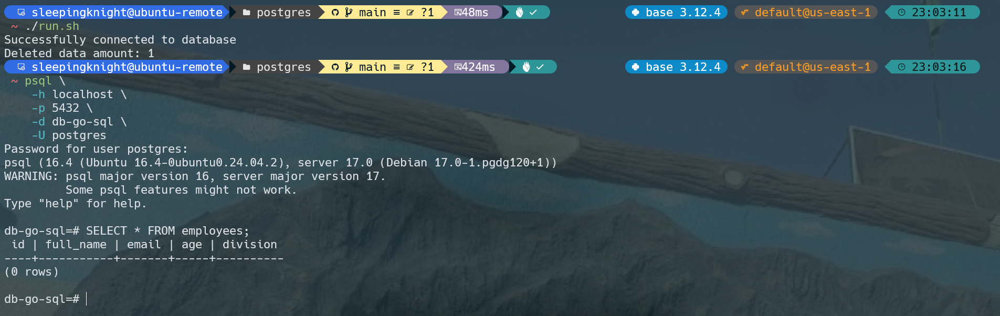

# Run the code using shell script

```shell
chmod +x run.sh
./run.sh
```

# Run simple postgres container using docker

```shell
docker run -d \
    --name go-postgres-container \
    -e POSTGRES_USER=postgres \
    -e POSTGRES_PASSWORD=postgres \
    -e POSTGRES_DB=db-go-sql \
    -p 5432:5432 \
    postgres
```

```shell
psql \
    -h localhost \
    -p 5432 \
    -d db-go-sql \
    -U postgres
```

# SQL

```sql
CREATE TABLE employees (
    id SERIAL PRIMARY KEY,
    full_name VARCHAR(50) NOT NULL,
    email TEXT UNIQUE NOT NULL,
    age INT NOT NULL,
    division VARCHAR(20) NOT NULL
);

SELECT * FROM employees;
```

# Go Client Testing


---

---

---

---

