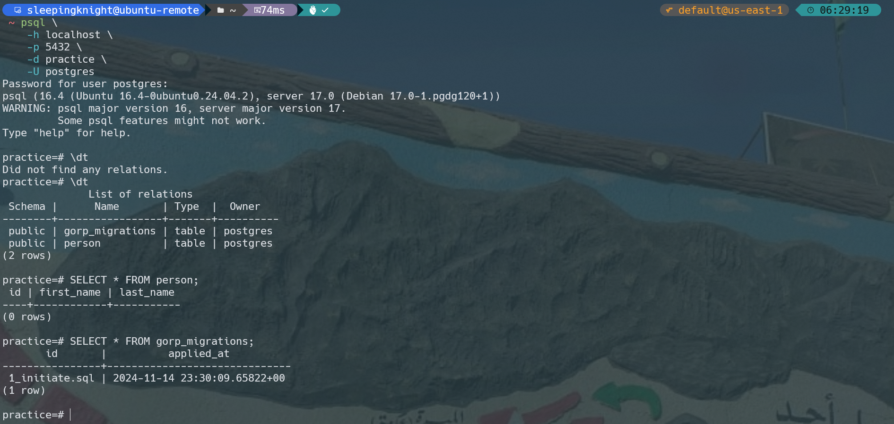

# Install Dependencies

```shell
go get -u "github.com/gin-gonic/gin"
go get -u "github.com/lib/pq"
go get -u "github.com/rubenv/sql-migrate"
go get -u "github.com/joho/godotenv"
```

# Run simple postgres container using docker

```shell
docker run -d \
    --name go-postgres-container \
    -e POSTGRES_USER=postgres \
    -e POSTGRES_PASSWORD=postgres \
    -e POSTGRES_DB=practice \
    -p 5432:5432 \
    postgres
```

```shell
psql \
    -h localhost \
    -p 5432 \
    -d practice \
    -U postgres
```

# Run the code using shell script

```shell
chmod +x run.sh
./run.sh
```

# API Testing


---

---

---

---

---

---

---

